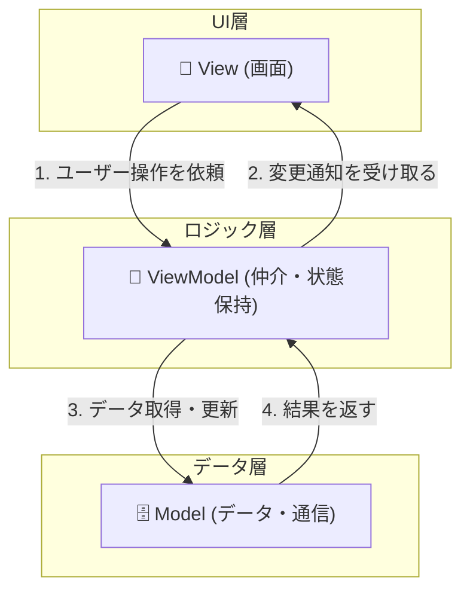
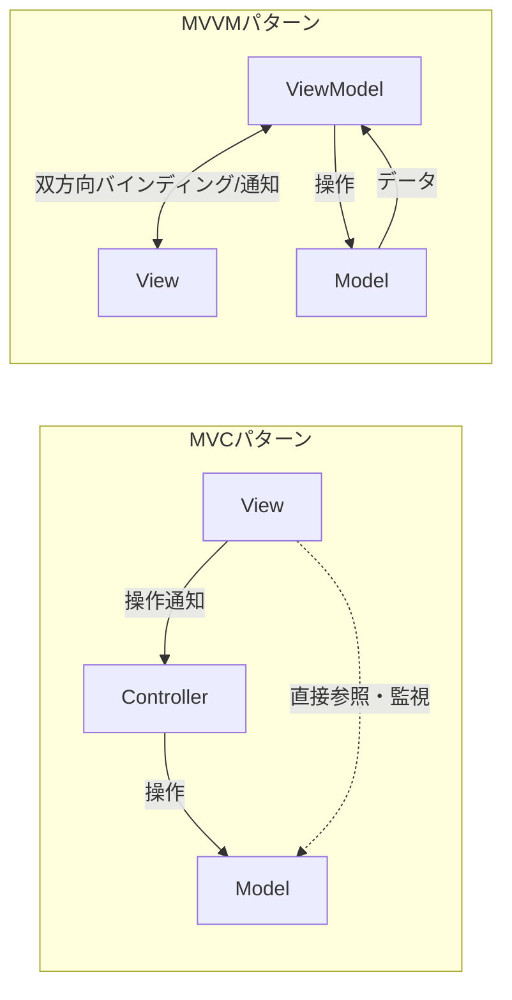
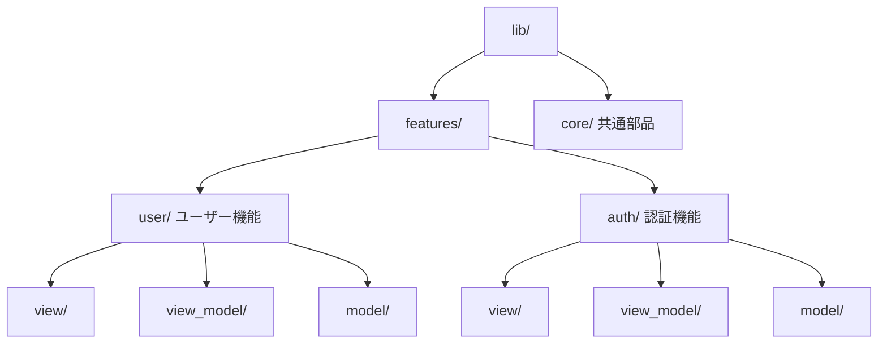

# 初心者向け：Flutter開発のための MVVM 入門

## 1. MVVM（Model-View-ViewModel）とは？

**「画面（見た目）」と「ロジック（中身）」をきれいに分けるための設計パターン**です。
プログラムの役割を以下の3つのチームに分割して管理します。

### 3つの役割定義

1.  **View (ビュー)**
    - **役割**: ユーザーが見る画面（UI）の構築。
    - **特徴**: ロジックを持たず、ViewModelから受け取ったデータを表示するだけ。
2.  **ViewModel (ビューモデル)**
    - **役割**: ViewとModelの仲介役。Viewに表示するためのデータを保持・加工し、Viewへ変更を通知する。
    - **特徴**: View（具体的なウィジェット）のことは知らず、Model（データ）のことは知っている。
3.  **Model (モデル)**
    - **役割**: データの保存、通信、アプリの核心となる計算処理。
    - **特徴**: UI（ViewやViewModel）のことは気にしない。純粋なデータ処理担当。

---

## 2. データの流れと関係図

MVVMにおけるデータの流れは「**ViewとModelが直接会話しない**」のが最大の特徴です。



> **ポイント**:
>
> - View は ViewModel を知っています。
> - ViewModel は Model を知っています。
> - **Modelは誰も知りません。**（矢印が自分に向かってくるだけ）
> - この「一方通行」の関係により、デザイン（View）が変わっても、ロジック（Model）に影響が出にくくなります。

---

## 3. MVC と MVVM の違い

違いは「**誰が画面用データを保持するか**」と「**ViewがModelを見るか**」です。

### 比較図 (Mermaid)



- **MVC (Model-View-Controller)**
  - **View**: Model（データ）を直接見に行って表示することが多い。
  - **弱点**: ViewとModelがくっついてしまい（依存）、修正が大変になりやすい。

- **MVVM (Model-View-ViewModel)**
  - **ViewModel**: Modelからデータを取り寄せ、**View用に加工して保持する**。
  - **View**: ViewModelだけを見る。Model（裏方）のことは一切知らない（完全に分離）。
  - **利点**: 分業やテストがしやすい。

---

## 4. Flutterでの実装イメージ

現代的な Flutter 開発では、**Riverpod** と **Freezed** を組み合わせた実装が一般的です。

### ① Model / State（データの定義）

**Freezed** を使って、不変（Immutable）なデータモデルや状態（State）を定義します。

```dart
// models/user_state.dart
import 'package:freezed_annotation/freezed_annotation.dart';

part 'user_state.freezed.dart';

@freezed
class UserState with _$UserState {
  const factory UserState({
    @Default('') String name,
    @Default(0) int age,
    @Default(true) bool isLoading,
  }) = _UserState;
}
```

### ② ViewModel（状態管理とロジック）

**Riverpod** の `Notifier`（または `AutoDisposeNotifier`）を継承し、状態の保持と更新ロジックを担当します。
状態の更新には **Freezed** の `copyWith` を使い、`state` に代入することで Riverpod が View へ変更を通知します。

```dart
// view_models/user_view_model.dart
import 'package:flutter_riverpod/flutter_riverpod.dart';
import '../models/user_state.dart';

// Notifier を継承して ViewModel を定義
class UserViewModel extends AutoDisposeNotifier<UserState> {
  @override
  UserState build() {
    // 最初の状態（初期値）を返す。
    // この戻り値が自動的に「state」という変数の中に保持されます。
    return const UserState();
  }

  // Viewからの依頼を受けて状態を更新する
  Future<void> fetchUserData() async {
    // state への代入（再セット）が、Viewへの「通知」のトリガーになります
    state = state.copyWith(isLoading: true);

    // データ取得処理（疑似コード）
    await Future.delayed(const Duration(seconds: 1));

    // Freezed の copyWith で不変な状態の一部だけを変更した新しいインスタンスを作成
    // state を差し替えることで、これを見ている View が自動的に再描画されます
    state = state.copyWith(
      name: 'Flutter太郎',
      age: 20,
      isLoading: false,
    );
  }
}

// 外部から利用するための Provider を手動で定義
final userViewModelProvider =
    NotifierProvider.autoDispose<UserViewModel, UserState>(
  UserViewModel.new,
);
```

<details>
<summary>（参考）riverpod_generator を使用した自動生成パターンのコード</summary>

```dart
// view_models/user_view_model.dart
import 'package:riverpod_annotation/riverpod_annotation.dart';
import '../models/user_state.dart';

part 'user_view_model.g.dart';

// @riverpod を付けると、内部で Notifier クラスを継承したクラスが自動生成されます
@riverpod
class UserViewModel extends _$UserViewModel {
  @override
  UserState build() {
    return const UserState();
  }

  Future<void> fetchUserData() async {
    state = state.copyWith(isLoading: true);
    await Future.delayed(const Duration(seconds: 1));
    state = state.copyWith(
      name: 'Flutter太郎',
      age: 20,
      isLoading: false,
    );
  }
}
```
</details>

### ③ View（画面表示）

**ConsumerWidget** を継承し、`ref.watch` で ViewModel の状態を監視します。

```dart
// views/user_page.dart
import 'package:flutter/material.dart';
import 'package:flutter_riverpod/flutter_riverpod.dart';
import '../view_models/user_view_model.dart';

class UserPage extends ConsumerWidget {
  @override
  Widget build(BuildContext context, WidgetRef ref) {
    // ViewModel の「状態（state）」を監視する
    final state = ref.watch(userViewModelProvider);
    // ViewModel の「操作（notifier）」を取得する
    final viewModel = ref.read(userViewModelProvider.notifier);

    return Scaffold(
      body: Center(
        child: state.isLoading
            ? const CircularProgressIndicator()
            : Text('名前: ${state.name}'),
      ),
      floatingActionButton: FloatingActionButton(
        onPressed: () => viewModel.fetchUserData(),
        child: const Icon(Icons.refresh),
      ),
    );
  }
}
```

---

## 5. ディレクトリ構成の例（Feature-first）

機能（Feature）ごとにフォルダを分けると、画面とロジックが近くに配置され、管理しやすくなります。



- **View**: `xxx_page.dart` (画面)
- **ViewModel**: `xxx_view_model.dart` (ロジック)
- **Model**: `xxx_repository.dart` (データ通信)

---

## 6. まとめ：MVVMを使うメリット

1.  **コードが読みやすくなる**
    - 「画面」と「ロジック」が混ざらないので、どこに何が書いてあるかすぐ分かります。
2.  **チーム開発が楽になる**
    - 「Aさんは画面（View）」「Bさんは機能（ViewModel/Model）」と完全に分けて作業でき、待ち時間が減ります。
3.  **テストが簡単になる**
    - ViewModelは画面（UI）のことを知らないため、アプリを起動しなくてもロジックだけのテストが簡単に書けます。
